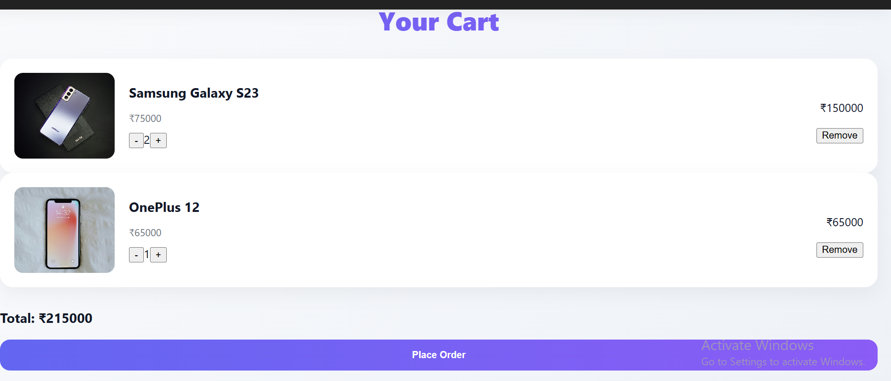
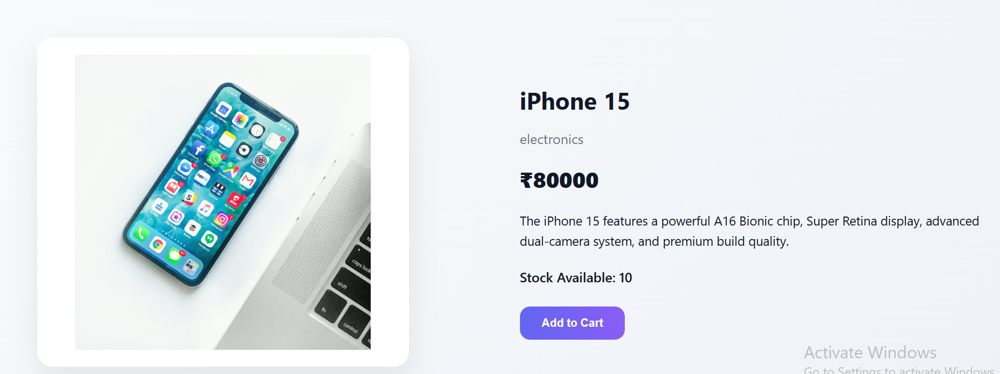
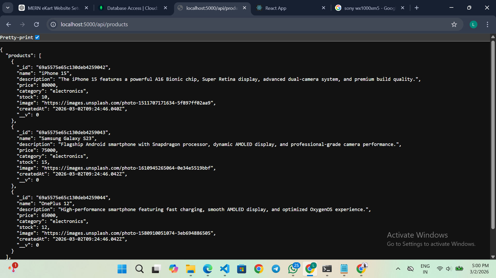

# 🛍 Mini Ekart – MERN Stack E-Commerce Module

A modern full-stack Mini E-Commerce application built using the MERN Stack (MongoDB, Express, React, Node.js).

This project demonstrates product management, cart functionality, quantity updates, and order placement with a clean modern UI.

---

## 🚀 Tech Stack

### Frontend
- React.js
- Context API (State Management)
- Axios
- Modern CSS (Custom styling)

### Backend
- Node.js
- Express.js
- MongoDB (Mongoose ODM)

---

## ✨ Features

### 🛒 Product Module
- View all products
- Search products
- Pagination support
- Product details page
- Responsive product cards

### 🧺 Cart Module
- Add to cart
- Increase / decrease quantity
- Remove item
- Dynamic total calculation

### 📦 Order Module
- Place order
- Store order in MongoDB
- Auto clear cart after order
- Success confirmation UI

---
## 📸 Screenshots

### 🏠 Home Page

### 🛒 Cart Page

### 📦 Product Details Page

